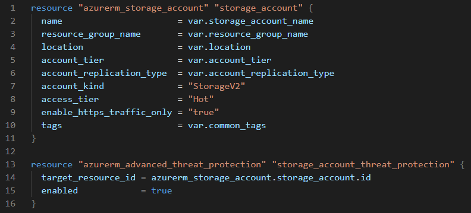
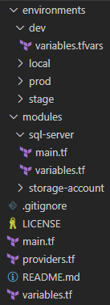

First of all, what is [Terraform](https://www.terraform.io/)? It is a great tool to describe your cloud infrastructure in the code (IaC) in a declarative way. The main benefit of using this approach is that you will be able to reproduce your infrastructure easily if something goes wrong. It also enables versioning and control over the changes you will make to the infrastructure. In this article, I am going to describe my own experience with Terraform while building infrastructure in Azure.

### A great alternative to the ARM template

In the past [ARM](https://docs.microsoft.com/en-us/azure/azure-resource-manager/templates/overview) template was the standard way to define infrastructure in Azure. ARM provided a way of describing infrastructure declaratively in JSON format. However, it has its downsides. I will list the most important ones to me:

* Verbose configuration. Don’t get me wrong, it is quite all right to describe the configuration in JSON as long as it does not get too long, but in case of ARM, it usually means writing a lot of JSON.
* Lack of resource validation before applying the changes to the real infrastructure.
* Steep learning curve.

### Terraform to the rescue

One day colleague of mine suggested trying Terraform as a potential replacement for the ARM templates. We already had quite a few ARM templates defined for existing infrastructure, but it was cumbersome to maintain them. There was a new project about to start and so I decided to give Terraform a shot.

Terraform configuration is described using HashiCorp Configuration Language (HCL). Here is the simple example of how it looks like to define Azure Storage Account.

```json
resource "azurerm_storage_account" "example" {
  name                     = "storageaccountname"
  resource_group_name      = "resource_group_name"
  location                 = "resource_group_location"
  account_tier             = "Standard"
  account_replication_type = "GRS"

  tags = {
    environment = "dev"
  }
}
```

Here is the example of the same Storage Account definition using ARM template.

```json
{
  "$schema": "https://schema.management.azure.com/schemas/2015-01-01/deploymentTemplate.json#",
  "contentVersion": "1.0.0.0",
  "parameters": {
    "storageAccountType": {
      "type": "string",
      "defaultValue": "Standard_LRS",
      "allowedValues": [
        "Standard_LRS",
        "Standard_GRS",
        "Standard_ZRS",
        "Premium_LRS"
      ],
      "metadata": {
        "description": "Storage Account type"
      }
    },
    "location": {
      "type": "string",
      "defaultValue": "[resourceGroup().location]",
      "metadata": {
        "description": "Location for all resources."
      }
    }
  },
  "variables": {
    "storageAccountName": "[concat('store', uniquestring(resourceGroup().id))]"
  },
  "resources": [
    {
      "type": "Microsoft.Storage/storageAccounts",
      "apiVersion": "2019-04-01",
      "name": "[variables('storageAccountName')]",
      "location": "[parameters('location')]",
      "sku": {
        "name": "[parameters('storageAccountType')]"
      },
      "kind": "StorageV2",
      "properties": {}
    }
  ],
  "outputs": {
    "storageAccountName": {
      "type": "string",
      "value": "[variables('storageAccountName')]"
    }
  }
}
```

After seeing such a huge difference in the amount of configuration that needs to be written, I decided to continue exploring Terraform.

### Managing configuration for multiple environments

This was the thing that I struggled with the most. How the heck I should organize the configuration to support configuration for different environments?

After reading quite a few blog posts about possible solutions, I came up with the following structure:



[VS Code](https://code.visualstudio.com/) has been my standard code editor already for some time. It is free and works on Windows, Mac, and Linux. I have installed [Azure Terraform](https://marketplace.visualstudio.com/items?itemName=ms-azuretools.vscode-azureterraform) extension for Terraform syntax support.

Variables are declared in the `variables.tf` file and usually assigned with a default value. Variable values for each environment are defined in the `variables.tfvars` file in the separate folders (`local, dev, stage, prod`).

When using such a structure, you can execute `terraform plan` command and specify the relative path to variables file:

`terraform plan -var-file="environments\\local\\variables.tfvars"`

You can examine the project structure in the GitHub repo: [https://github.com/viktors-telle/terraform](https://github.com/viktors-telle/terraform)

### Using modules

The module is an excellent way to unify multiple resource definitions that are used together. The module `sql-server` contains definitions of the Azure SQL Server, Azure SQL Server firewall rules, and Azure SQL Elastic Pool.

All modules are called in the `main.tf` file. Here is an example of how you call the `sql-server` module in the `main.tf` file.

```json
module "sql-server" {
    source                     = "./modules/sql-server"
    resource_group_name        = var.resource_group_name
    location                   = var.location
    common_tags                = local.common_tags
    sql_server_name            = var.sql_server_name
    sql_administrator_login    = var.sql_administrator_login
    sql_administrator_password = var.sql_administrator_password
    sql_firewall_rules         = var.sql_firewall_rules
}
```

### Storing secrets

Never store sensitive data in the code repository. Arguably you can store sensitive data for the development environment to ease up onboarding of the new team members, but only when you use a private repository.

Luckily, Terraform provides a way of passing such data to the template during the deployment process. In the examples below, Azure Storage Account access key and Azure AD Service Principal secret are considered as the sensitive data.

Example of the `terraform init` command where Azure Blob Storage is used as remote storage to store Terraform resource state in a [centralized way](https://www.terraform.io/docs/backends/types/azurerm.html):

```json
terraform init
-backend-config="storage_account_name=${nameofyourstorageaccount}"
-backend-config="container_name=${blob_container_name}"
-backend-config="key=${blob_file_name}"
-backend-config="access_key=${storage_account_access_key}"
-input=false
```

Below is the example of the `terraform plan` command where `azure_client_secret` of Azure AD service principal is used for authentication to the Azure:

```json
terraform plan
-var-file="environments/${environment}/variables.tfvars"
-var "azure_client_secret=${azure_client_secret}"
-input=false
-detailed-exitcode
-out=tfplan
```

[Guide on how to create a new service principal in Azure.](https://www.terraform.io/docs/providers/azurerm/guides/service_principal_client_secret.html)

`${storage_account_access_key}` and `azure_client_secret` values can be passed as the parameters from the Azure Key Vault, for example.

### Pros and cons

Terraform is not perfect, and has some downsides. I have listed some pros and cons that are important to me.

**Pros**:

* Able to store Terraform resource state centrally in Azure Blob Storage, which allows running automatic deployments, e.g., Azure DevOps multi-stage deployments.
* `terraform plan` is an excellent command to validate your configuration before applying. It helps tremendously.
* Gentle learning curve.

**Cons**:

* Not everything is validated during `terraform plan` command execution. As an example, I can mention virtual machine scale set extensions. If you make a mistake in extension configuration, you will probably not see the errors during `terraform plan` command, but rather when applying the configuration using `terraform apply` command.
* `terraform import` command is lacking the generation of the actual resource configuration. Currently, it supports only importing existing state into state file that helps a bit, but not too much if you have a large infrastructure.
* Not all resources can be described via Terraform.

### Final words

Currently, I am finalizing the migration of existing infrastructure described using ARM templates to Terraform. Terraform has proven to be convenient to use on a broader scale. Unfortunately, there is no straightforward way to replace ARM templates with Terraform templates since, at the moment of writing, Azure does not support exporting the existing resources in HCL format. To reduce manual work of translating ARM JSON to HCL, I have written a tool in C# that performs naive conversion of Terraform state file (created by the `terraform import` command) to HCL resource configuration.

In my next article, I am going to focus on Terraform configuration deployment automation using Azure DevOps pipelines.
