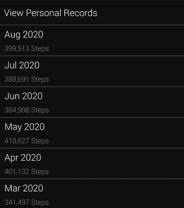

I work from home for five months. I will lie if I say that it was easy. It definitely would have been easier if I did not have two small kids at home. I know that because I had worked remotely in the past when I did not have kids. In general, I was more productive at home than working at the office. The main reason for that is fewer distractions. Currently, I am a system architect at a large enterprise company. Before Covid-19 started, I worked from home occasionally. Mostly to allow my wife to do the important things for her while I look after our daughter. We had only one child at that time. Most of the parents will probably agree with me that it is much easier to manage your day if you have only one child. Now we have two kids with a small age difference. And it is much harder now to organize your day so that everyone is happy.

## Decide On Your Working Hours

Find the most productive and acceptable time for work. For me, it is morning. I wake up at 6:00 and work until my daughter (oldest child) wakes up, which is usually around 7:00. Then I prepare the breakfast for us. I let my wife sleep until 8:00 since she has to wake up in the night to feed our son. Then I spent about 30 minutes with them, make a coffee, and switch back to work mode. I have a separate working room, and the doors are closed when I am working. If something important happens, then my wife can come and ask for my assistance. We eat lunch together at noon. After lunch, I go for a walk with my daughter. I listen to a [few podcasts](https://www.viktorstelle.com/blog/podcasts-that-i-recommend-listening-to/) when she falls asleep. After one hour of walk, I usually leave her to sleep outside by the window and resume working. When she wakes up, I go downstairs and bring her home for an afternoon snack. After that, I continue to do my tasks for a few more hours.

To conclude the daily routine topic, I must say that effectively my workday is organized into many 1–2 hour sprints, which is fine, and I manage to do my job.

## Spend Time With Your Kids

I beg to differ with the statement that the father should only work, and the mother should take care of the children. Of course, the mother does most of the job, but the father should be a part of raising the children, especially when children are at a young age. It helps you to develop a strong relationship with your children. Dedicate at least a couple of hours a day to spent quality time with children without distractions. Do not use smartphones and other sorts of gadgets. I have noticed that quite a few parents stare in the screens when going out with their kids. Try to avoid that as much as possible. Probably that email or message can wait. Usually, people call when something urgent is needed. I spent at least 2–3 hours with my daughter every day. Every weekend I take her with me to drive to someplace like a playground, forest, watch airplanes near the airport. I am not perfect and sometimes I spend less time with her. Try not feeling guilty about it, but decide on one activity that you will do together every day. We have put to bed routine that I do every evening to keep bonding with her.

## Find The Activity To Keep You Fit And Healthy

I walk every day to stay fit. There are plenty of sports activities available such as running, swimming, cycling. Get yourself a smartwatch or fitness tracker to help you stay motivated. I have a smartwatch, and I check every day if I reach the 10k steps daily goal. If you think that walking is boring, try listening to podcasts or music. Also, why not try exercising during the day if your work schedule allows it. Here are my statistics for the last 6 months.

For example, in May I did 13 246 steps on average per day.

### Trying To Eat Healthy Food

Whether I want it or not, I tend to eat healthier food. We, as a family, try to eliminate salt, sugar, and white flour from our menu, and eat more vegetables. Also, we eat more or less at the same time every day, which helps to live a healthier lifestyle.

## How To Stay Focused

Try to eliminate all the unnecessary distractions like social networks. You would be surprised how much time they eat from your day. I use an app called [Cold Turkey](https://getcoldturkey.com/), which blocks certain websites such as social networks, YouTube, Reddit, in all browsers. It works, and I am more focused on my tasks. Also, focus on one concrete task and get it done. Doing many tasks in parallel usually does not work so well, and in the end, you get done fewer things. In the time window during the morning from 6–7 AM, I completely ignore the phone and emails and focus on the chosen task.

## Find Time For Your Hobbies

I have found a few new hobbies recently. Writing and studying investing are among them. Mostly, I write during weekends or early in the morning. Podcasts like [We Study Billionaires](https://www.theinvestorspodcast.com/we-study-billionaires/) are the primary source of knowledge when it comes to investing and finances. I also check the financial news on [Yahoo Finance](https://finance.yahoo.com/). I am sure you already have some hobbies, or you can discover them. Just find the specific time to focus on them. Some of you might say that I don’t have time for hobbies. It might be correct, but it could be that you spent a lot of time watching movies, shows, or playing video games. It is OK if these are your hobbies, but if not, then consider reducing the time spent on these activities.

## Find Time To Relax

It is normal to relax in the evening and do virtually nothing. We are not robots and should not work for the whole day. Most importantly, listen to yourself. If you feel tired, stop working and rest for a while.

## Conclusion

Here are the key takeaways from my article:

* Set up the daily routine and stick to it.
* Spend quality time with your kids without gadgets.
* Choose your sports activity and do it regularly. Buy a smartwatch or fitness tracker for additional motivation.
* Eat regularly and avoid using salt, sugar, and white flour in your meals.
* Do one task at a time and eliminate distractions such as social networks.
* Do not forget about your hobbies and allocate some time for them.
* Do not work non-stop. Find time to rest. Go outside for a walk, grab a coffee, or lay down.