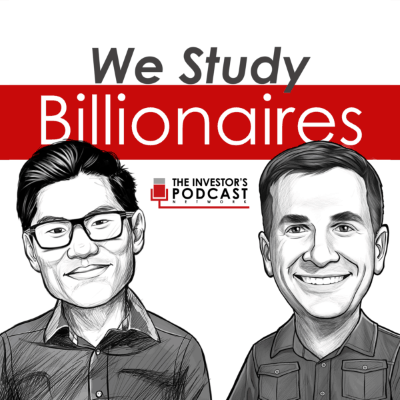
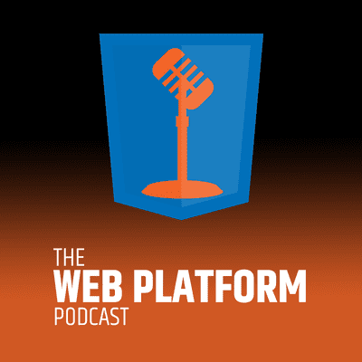
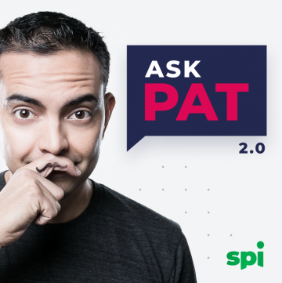
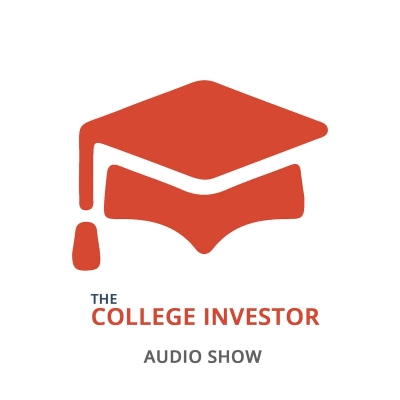

 on [Unsplash](https://unsplash.com?utm_source=medium&utm_medium=referral)](phone-with-headphones.jpg)

When the Covid-19 outbreak started, I started to work from home as many people did. It meant that I do not have to spend extra hours on the commute. So I decided to spend the saved time to invest more in broadening my knowledge in finance, entrepreneurship, and information technology. Investing in your knowledge is the best investment that you could do. Listening to the podcasts was one of the new things that I started to do. I mostly listen to them during my everyday walk with my daughter, but only when she falls asleep in the stroller.

Here is the list of the five podcasts that I listen to regularly.

## We Study Billionaires

First, I wanted to understand finances better so I did the research and found a couple of promising podcasts. This is one of my favorites. It comes out every Sunday and informs you of the latest developments in economics and investing. The podcast hosted by Preston Pysh and Stig Brodersen talks about the investment strategies of famous investors like Warren Buffet and Ray Dalio. They also review popular books on investing and entrepreneurship and invite guests to talk about the latest trends in economics and investing. I especially enjoyed these episodes:

[TIP307: Cullen Roche on Stocks, Inflation, & COVID-19 (Business Podcast)](https://open.spotify.com/episode/5cR75xNOBhZnsO9r9zwq12?si=fjjTnt7VR2uaByZAbuAQXw)

[TIP 011 : Billionaire Jeff Bezos - The Secrets to his Success (Investing Podcast)](https://open.spotify.com/episode/1WgFC5ajRTTyKlNcrE3KYo?si=IvnxRxuXS9KCMc0cMy7jxw)

[TIP 014 : Guy Spier - The Education of a Value Investor (Investing Podcast)](https://open.spotify.com/episode/5v09LZG7Np60A7CTvQ0hhq?si=dI_U0-AbQUSbWKFe3IcQHg)

[Link to the show on Spotify](https://open.spotify.com/show/28RHOkXkuHuotUrkCdvlOP?si=sgpBam5cTV-00FPWApTThA)

## Techmeme Ride Home

This podcast comes out every weekday. Brian does a great job informing listeners of the latest technology news such as product news, recent acquisitions, earnings reports of the big tech companies. This podcast is based on [techmeme.com](https://www.techmeme.com/), which is Silicon Valley's most-read news source.

[Link to the show on Spotify](https://open.spotify.com/show/1jBNbPVlGUen3sWdd25ho6?si=TPm4Ua8ASnqhMr6cFOQ78w)

## The Web Platform Podcast

I am a web developer myself. It is only reasonable that I should listen to the podcast that talks about the latest trends in web development.

This podcast was founded in 2014 by HTML W3C invited expert Erik Isaksen. It covers the latest topics in web development such as [Deno](https://deno.land/), which is the new runtime for JavaScript and TypeScript, and an alternative to [Node.js](https://nodejs.org/), modern HTML practices, or the latest tools for the web development.

[Link to the show on Spotify](https://open.spotify.com/show/3apF0cv7ub3mC3J5e7Lq6v?si=NKRzqe9XSM-qHJFi93PPtA)

## AskPat 2.0

When it comes to entrepreneurship podcast by Pat Flynn is the best. This podcast comes out every day. Pat answers one question asked by one of his listeners. Questions like: 

* How to create the best "About" page on your website?
* How to increase engagement and participation in your community? 
* How do you handle negative reviews?

These and many more questions get answered during the show and help you and your business to perform better. Probably later I will also listen to another Pat Flynn's podcast: "[The Smart Passive Income Online Business and Blogging Podcast](https://open.spotify.com/show/7wjv5MRCXWXImqTFhcufLy?si=EK4-SNgZRi6OrHW_NOYNdw)".

[Link to the show on Spotify](https://open.spotify.com/show/00CuvjXkTsBJkp7F2v1Rjl?si=IHAYvyNaQcCy_X6Z89MC_Q)

## The College Investor Audio Show

One more podcast covering finances and investing. I watched some episodes on topics that interested me at a particular time. For example:

* The Cheapest Investing Platforms and Robo-advisors.
* 6 Ideas to Diversify Your Income Streams
* How To Invest In Stocks

[Link to the show on Spotify](https://open.spotify.com/show/2WtF5XvOdiNNLSXbkPmvLa?si=FqYbpLBpT12V267ITgKpWw)

## Final Words

You can find all of these podcasts on Spotify. I have provided the links above. I encourage you to give them a shot and hope that you will enjoy them as I do. What are your favorite podcasts?
