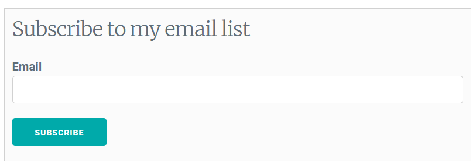
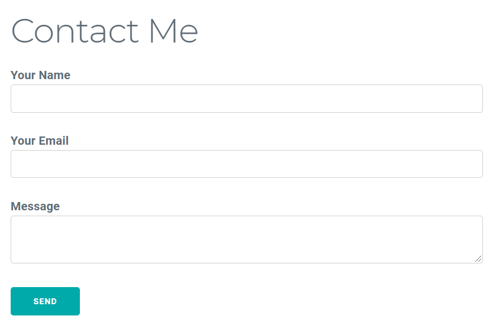

I have recently updated the design of the site and added a few new features to make my site complete. Continue reading to learn, which services and technologies I have used.

## New Design

The previous design seemed a bit incomplete for me. Then I heard about a relatively new CSS library called [Milligram](https://milligram.io/) in the [C# 9 with Mads Torgersen](https://open.spotify.com/episode/2IPwqSVfQGTStMwadIHtLV?si=zgOce7IWTA6nsNU9Dyf1CA) podcast episode of [.NET Rocks](https://dotnetrocks.com/). It is a lightweight library, which weights only 2kb gzipped. I added CDN links to it and tweaked the colors a bit. Here are the links that you need to include in the HEAD part of your website.

```html
<link rel="stylesheet" href="https://fonts.googleapis.com/css?family=Roboto:300,300italic,700,700italic">

<link rel="stylesheet" href="https://cdnjs.cloudflare.com/ajax/libs/normalize/8.0.1/normalize.css">

<link rel="stylesheet" href="https://cdnjs.cloudflare.com/ajax/libs/milligram/1.4.1/milligram.css">
```

- - -

## New Features

I have added two new features - Mailing List and Contact Page.

### Mailing List



You can now subscribe to my mailing list to keep up-to-date with the latest articles from me. Mailchimp seemed like a good choice, so I had to look if there is a plugin for Gatsby, and of course, there was already a [plugin](https://www.gatsbyjs.com/plugins/gatsby-plugin-mailchimp/) for Mailchimp integration. I have built a [React function component](https://reactjs.org/docs/components-and-props.html#function-and-class-components), which you can check out in the [GitHub repo](https://github.com/viktors-telle/personal-blog/blob/master/src/components/emailList.js) of this website. I decided to add the mailing list in the two places for better engagement. The first one is at the top of the blog section, and the second one is at the end of each article.

- - -

### Contact Page



I have added a contact form, which you can find [here](https://www.viktorstelle.com/contact). I have used [Netlify Forms](https://docs.netlify.com/forms/setup/#html-forms) as a form submission back-end because I was already using the [Netlify platform](https://www.netlify.com/) to host my website, and they are also for free. I have used this [Gatsby guide](https://www.gatsbyjs.com/docs/building-a-contact-form/#netlify) to get started.

What features do you think are still missing? Please share your thoughts in the comment section below.
